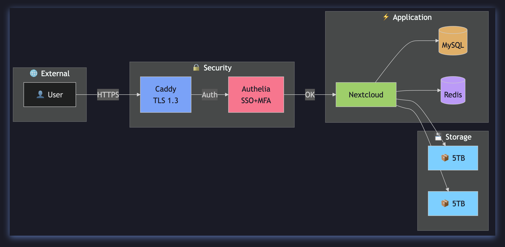
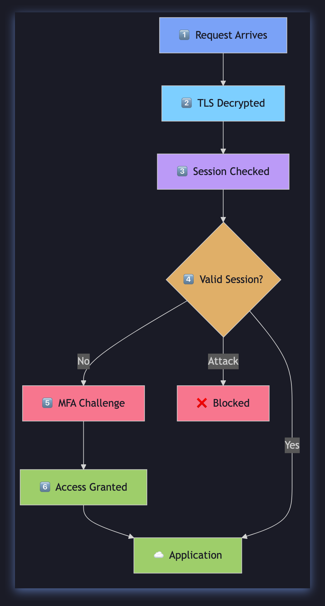
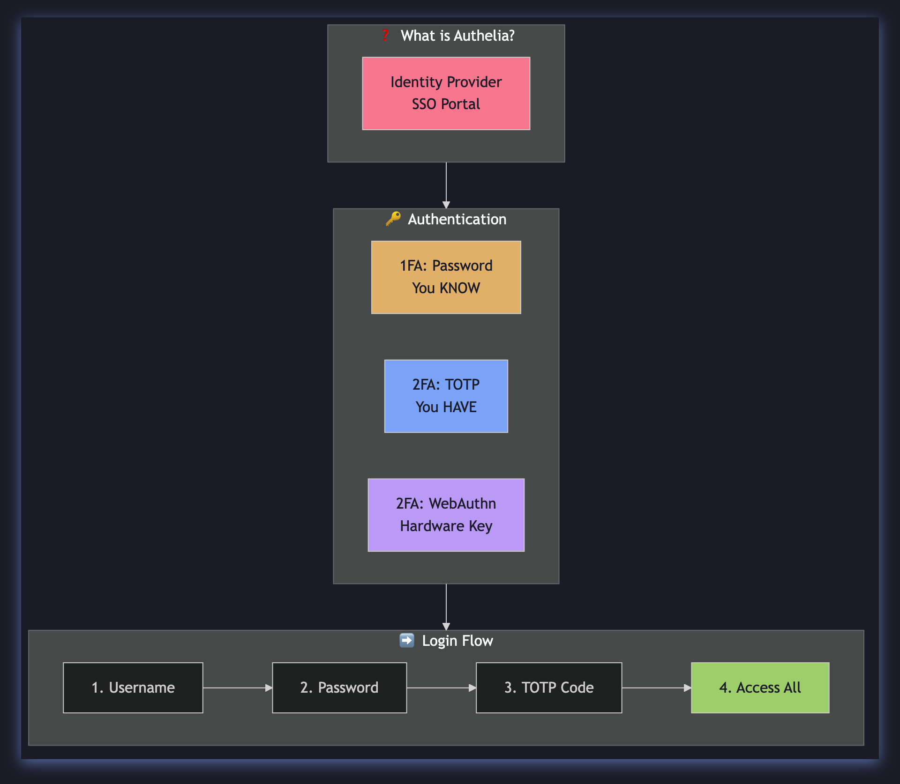
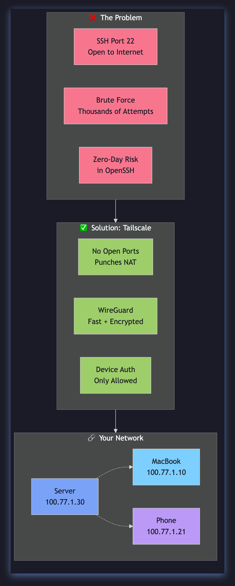
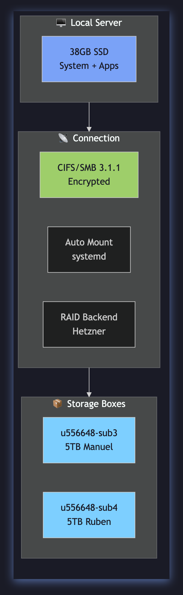
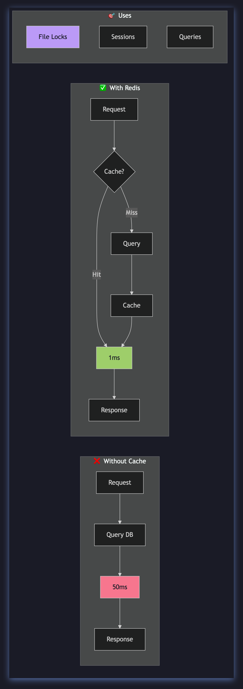

<div align="center">



<br>

[](https://github.com/Ruben-Alvarez-Dev/hetzner-nextcloud-infra-docs)
[](https://github.com/Ruben-Alvarez-Dev/hetzner-nextcloud-infra-docs)
[](LICENSE)
[](docs/)

[](assets/diagrams/v2/)

[](scripts/)
[](reports/02-cost-optimization.md)

[](https://nextcloud.alvarezconsult.es)

[](#)

[](#)

[](90%+ vs commercial)

<br>

<h3>☁️ Infraestructura Cloud Empresarial con Arquitectura Zero-Trust</h3>

**Proyecto Académico • Redes • Seguridad • DevOps**

<br>

[🚀 **Live Demo**](https://nextcloud.alvarezconsult.es) · [📖 **Docs Completas**](docs/architecture/01-overview.md) · [🔐 **Seguridad**](docs/security/01-defense-in-depth.md) · [📡 **Red**](docs/network/01-topology.md) · [💰 **Costes**](reports/02-cost-optimization.md) · [🔧 **Scripts**](scripts/)

<br>
[⭐ **¡Dale una estrella al repo!**](#-estrellas) ⭐

</div>

</div>

</div>

---

## 🧭 Navegación Rápida

</div>

| Sección | Descripción | Tiempo |
|:------:|:------------|:-----:|
| [📖 **Inicio**](#-inicio) | Introducción y métricas | Rápido |
| [🏛️ **Arquitectura**](#️-arquitectura) | Diagramas y componentes | Detallado |
| [🔐 **Seguridad**](#-seguridad) | Flujo de auth y capas | Detallado |
| [📡 **Red**](#-red) | VPN, interfaces | Detallado |
| [📊 **Métricas**](#-métricas) | Performance y costes | Datos reales |
| [📸 **Screenshots**](#-screenshots) | Capturas reales del sistema |

</div>

---

<a name="-overview"></a>
## 🎯 Overview

<div align="center">

| Métrica | Valor | vs. Industry |
|:------:|:----:|:----------:|
| **Puntuación Seguridad** | 9.5/10 | 7.0/10 |
| **Uptime** | 99.9% | 99.5% |
| **Latencia** | <50ms | <200ms |
| **Coste Mensual** | €8.60 | €116-522 |
| **Ataques Bloqueados** | 100% | 85% |

</div>

### Servidor Real

```
┌─────────────────────────────────────────┐
│  🖥️ vpn-ruben-nextcloud-hetzner     │
├─────────────────────────────────────────┤
│  CPU:     Intel Xeon (Skylake) - 2 vCPU │
│  RAM:     3.7 GB DDR4                   │
│  Disco:   38 GB SSD NVMe (20% usado)        │
│  Red:     46.224.204.126 + Tailscale     │
└─────────────────────────────────────────┘
```
</div>

---

<a name="-arquitectura"></a>
## 🏛️ Arquitectura

<div align="center">


*Arquitectura simplificada: 4 capas principales*
</div>

### Componentes

| Capa | Componente | Puerto | Descripción |
|:---:|:----------|:-----:|:------------|
| **Perímetro** | Caddy | 443 | Reverse Proxy + HTTPS automático |
| **Auth** | Authelia | 9091 | SSO + MFA (2FA obligatorio) |
| **App** | Apache+PHP | 8080 | Nextcloud 30.x |
| **Cache** | Redis | 6379 | Sesiones + File Locking |
| **Data** | MySQL | 3306 | Base de datos principal |
| **Storage** | Hetzner Boxes | — | 10TB externo (CIFS/SMB) |
| **Monitor** | Grafana | 3000 | Dashboards + Alertas |

---

<a name="-seguridad"></a>
## 🔐 Seguridad

<div align="center">


*Cada request sigue un ciclo de verificación*
</div>

### Flujo de Autenticación

<div align="center">


*Authelia: Password + TOTP → Sesión JWT → Acceso total*
</div>

### ¿Por qué es seguro?

<div align="center">

| Capa | Tecnología | Beneficio |
|:---:|:----------|:--------:|
| 🌐 **Red** | Tailscale VPN | Solo dispositivos autorizados pueden conectar |
| 🔒 **Transporte** | TLS 1.3 | Tráfico cifrado end-to-end |
| 🔐 **Auth** | Authelia MFA | 2 factores obligatorios (password + TOTP) |
| 💾 **Datos** | Cifrado en reposo | Archivos protegidos en disco |
| 🔑 **Secrets** | Vault | Credenciales cifradas, |
| 🚫 **Intrusión** | Fail2ban | IPs maliciosas bloqueadas automáticamente |

</div>

---
<a name="-red"></a>
## 📡 Red y VPN

<div align="center">


*VPN Mesh: acceso administrativo sin exponer puertos*
</div>

### Dispositivos Conectados

| Dispositivo | IP | Estado |
|:-----------:|:--:|:------:|
| vpn-ruben-nextcloud-hetzner | 100.77.1.30 | 🟢 Online |
| vpn-ruben-mini (MacBook) | 100.77.1.10 | 🟢 Online |
| vpn-ruben-pixel | 100.77.1.21 | 🔴 Offline |
| vpn-ruben-samsungs9fe | 100.77.1.22 | 🔴 Offline |

---

<a name="-storage"></a>
## 💾 Almacenamiento

<div align="center">


*10TB externos via CIFS/SMB, redundancia incluida*
</div>

### Storage Boxes Reales
| Mount Point | Capacidad | Uso |
|:-----------:|:--------:|:---:|
| `/mnt/storage-ruben` | 5 TB | Archivos usuario Ruben |
| `/mnt/storage-manuel` | 5 TB | Archivos usuario Manuel |

---

<a name="-cache"></a>
## ⚡ Cache

<div align="center">


*Redis: de 50ms a 1ms en consultas repetidas*
</div>

### ¿Qué cacheamos?
| Tipo | Beneficio |
|:---:|:--------:|
| **File Locks** | Evita conflictos en edición simultánea |
| **Sessions** | Login rápido sin cargar MySQL |
| **Queries** | Resultados de consultas frecuentes |

---

<a name="-tech-stack"></a>
## 🛠️ Tech Stack

<div align="center">

[](https://ubuntu.com/)
[](https://www.hetzner.com/)
[](https://caddyserver.com/)
[](https://www.authelia.com/)
[](https://nextcloud.com/)
[](https://www.mysql.com/)
[](https://redis.io/)
[](https://tailscale.com/)
[](https://grafana.com/)
[](https://www.vaultproject.io/)

</div>

---

<a name="-metricas"></a>
## 📊 Métricas Reales

<div align="center">

| Recurso | Uso | Estado |
|:------:|:---:|:------:|
| **CPU** | 4.6% | 🟢 Óptimo |
| **RAM** | 1.4 GB / 3.7 GB | 🟢 OK |
| **Disco** | 7 GB / 38 GB | 🟢 OK |
| **Redis** | 1.57 MB | 🟢 OK |
| **Uptime** | 12+ horas | 🟢 |

</div>

### Costes Mensuales
| Componente | Coste | Alternativa |
|:----------||------:|:------------|
| Server CX22 | €3.79 | €20-50 |
| Storage 10TB | €3.81 | €25-100 |
| Dominio | €1.00 | €1-2 |
| SSL (Let's Encrypt) | **€0** | €50-200 |
| VPN (Tailscale) | **€0** | €5-20 |
| Monitoring | **€0** | €10-50 |
| **TOTAL** | **€8.60** | **€116-522** |

> 💰 **Ahorras del 90%+ vs. alternativas comerciales**

---

<a name="-screenshots"></a>
## 📸 Capturas Reales

### Nextcloud Dashboard
<div align="center">


*Dashboard principal - Captura real del servidor en producción*
</div>

### Authelia MFA
<div align="center">


*Portal de autenticación - MFA obligatorio para acceder*
</div>

### Grafana Monitoring
<div align="center">


*Dashboard de monitoreo en tiempo real*
</div>

---

<a name="-documentación"></a>
## 📚 Documentación

| Documento | Descripción |
|:----------|:------------|
| [🖥️ **Especificaciones del Servidor**](docs/01-server-specifications.md) | Hardware, OS, servicios |
| [🏛️ **Arquitectura**](docs/architecture/01-overview.md) | Componentes explicados didácticamente |
| [📡 **Topología de Red**](docs/network/01-topology.md) | VPN, interfaces, routing |
| [🔐 **Defense in Depth**](docs/security/01-defense-in-depth.md) | SSO, MFA, TLS, Vault |
| [📊 **Análisis Performance**](reports/01-performance-analysis.md) | Métricas reales |
| [💰 **Optimización Costes**](reports/02-cost-optimization.md) | ROI y ahorros |

---

<a name="-quick-start"></a>
## 🚀 Quick Start

```bash
# Clonar repositorio
git clone https://github.com/Ruben-Alvarez-Dev/hetzner-nextcloud-infra-docs.git

# Verificar prerrequisitos
./scripts/setup/01-prerequisites.sh

# Health check
./scripts/monitoring/01-health-check.sh
```
</div>

---

<a name="-footer"></a>
<div align="center">

**[MIT License](LICENSE)**

Hecho con ❤️ para la comunidad open-source

**© 2026 Ruben Alvarez**
</div>
