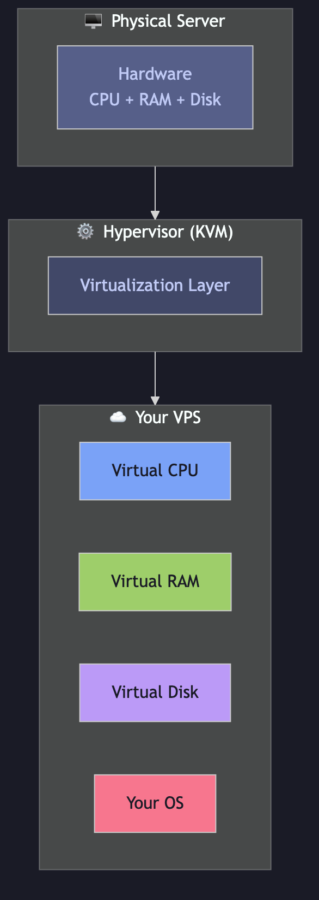
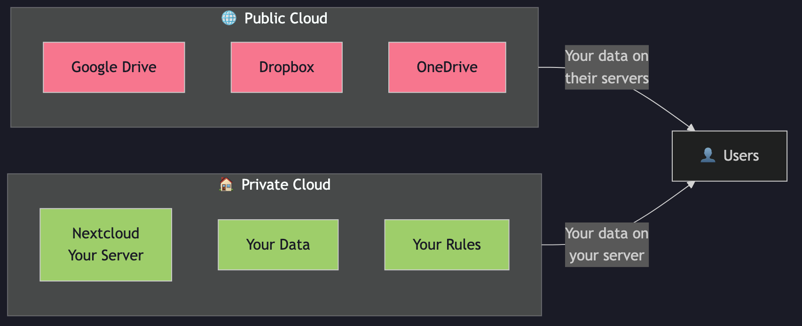
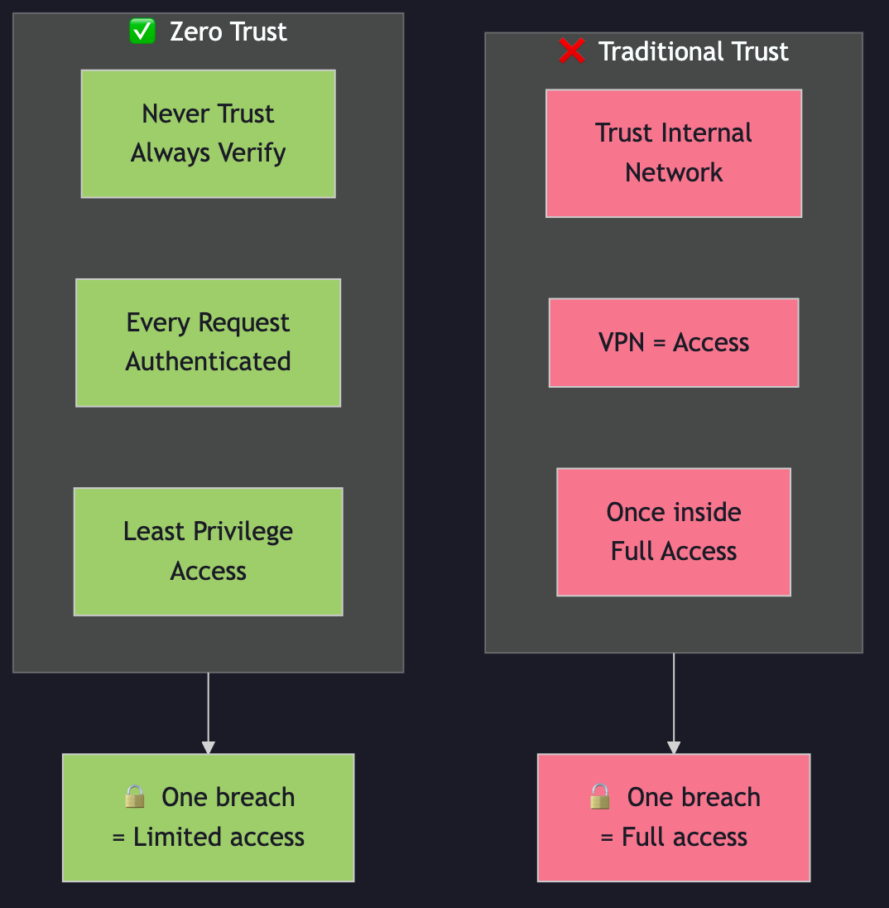
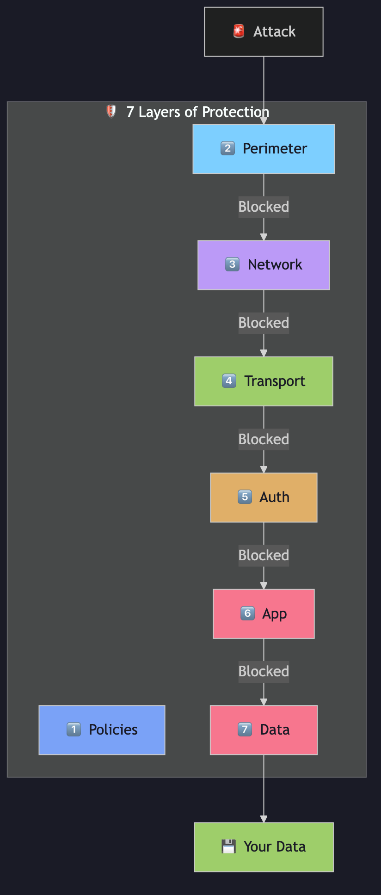
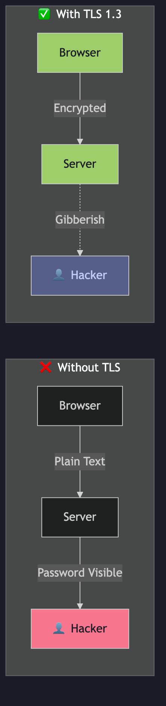
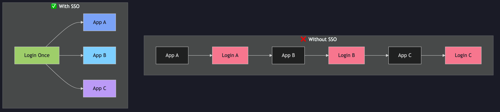
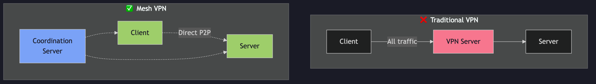

<div align="center">

[](https://github.com/Ruben-Alvarez-Dev/hetzner-nextcloud-infra-docs)
[](docs/security/)
[](LICENSE)

<h1>☁️ Hetzner Nextcloud Infrastructure</h1>

<h3>Private Cloud con Arquitectura Zero-Trust</h3>

**Proyecto Académico • Redes • Seguridad • DevOps**

[🚀 **Demo**](https://nextcloud.alvarezconsult.es) · [📖 **Docs**](docs/) · [📊 **Reportes**](reports/) · [🔧 **Scripts**](scripts/)

</div>

---

## 🧭 Navegación

| Sección | Contenido |
|:-------:|:----------|
| [📚 **Fundamentos**](#-fundamentos) | Conceptos: VPS, Cloud Privado, Zero Trust, TLS, SSO, VPN |
| [🏛️ **Arquitectura**](#️-arquitectura) | Componentes, diseño multicapa |
| [🔐 **Seguridad**](#-seguridad) | Defense in Depth, flujo de auth |
| [📡 **Red**](#-red) | VPN Mesh, interfaces |
| [📊 **Métricas**](#-métricas) | Performance y costes reales |
| [📸 **Galería**](#-galería) | Capturas del sistema |

---

## 📚 Fundamentos

> Antes de ver la arquitectura, entendamos los conceptos básicos.

### 1. ¿Qué es un VPS (Cloud Server)?

<div align="center">

</div>

Un **VPS (Virtual Private Server)** es una máquina virtual que se ejecuta en un servidor físico compartido:

- **Hardware físico** → Un servidor potente con CPU, RAM y disco
- **Hypervisor (KVM)** → Software que divide el hardware en partes virtuales
- **Tu VPS** → Recursos dedicados (CPU virtual, RAM virtual, disco virtual)

**Ventaja**: Pagas solo lo que necesitas, no todo el hardware.

---

### 2. Cloud Público vs Cloud Privado

<div align="center">

</div>

| Aspecto | Cloud Público (Google, Dropbox) | Cloud Privado (Nextcloud) |
|:-------:|:-------------------------------|:--------------------------|
| **Datos** | En sus servidores | En TU servidor |
| **Privacidad** | Pueden acceder | Solo TÚ accedes |
| **Control** | Sus reglas | Tus reglas |
| **Coste** | €10-50/mes | €8.60/mes |

**Por qué elegimos privado**: Privacidad total, control absoluto, menor coste.

---

### 3. Zero Trust: Nunca Confíes, Siempre Verifica

<div align="center">

</div>

**Tradicional**: "Si estás dentro de la red, eres de confiar" → Un solo punto de falla

**Zero Trust**: "Nunca confíes, siempre verifica" → Cada request es autenticada

| Modelo | Si alguien entra... | Resultado |
|:------:|:------------------:|:---------:|
| Tradicional | Tiene acceso total | 💀 Desastre |
| Zero Trust | Solo tiene acceso limitado | ✅ Daño mínimo |

---

### 4. Defense in Depth: 7 Capas de Seguridad

<div align="center">

</div>

Como una cebolla: si pelas una capa, hay otra debajo protegiendo.

| Capa | Protección |
|:----:|:-----------|
| 1️⃣ Políticas | Procedimientos, auditorías |
| 2️⃣ Perímetro | Firewall, rate limiting |
| 3️⃣ Red | VPN, segmentación |
| 4️⃣ Transporte | TLS 1.3, cifrado |
| 5️⃣ Autenticación | SSO + MFA |
| 6️⃣ Aplicación | CSP, validación |
| 7️⃣ Datos | Cifrado en reposo |

**Objetivo**: Si una capa falla, las demás siguen protegiendo.

---

### 5. TLS: Cifrado en Transporte

<div align="center">

</div>

**Sin TLS**: Tus datos viajan en texto plano → Cualquiera puede leerlos

**Con TLS 1.3**: Tus datos viajan cifrados → Nadie puede leerlos

| Escenario | Sin TLS | Con TLS |
|:---------:|:-------:|:-------:|
| Contraseña en login | Visible | Cifrada |
| Archivos subidos | Legibles | Ilegibles |
| Comunicación | Insegura | Segura |

**Implementación**: Caddy con Let's Encrypt automático.

---

### 6. SSO: Single Sign-On

<div align="center">

</div>

**Sin SSO**: Una contraseña para cada aplicación → Muchas contraseñas, riesgo alto

**Con SSO**: Un solo login para todas las apps → Una contraseña + 2FA, seguridad alta

| Sistema | Logins | Riesgo |
|:-------:|:------:|:------:|
| Sin SSO | 5 apps = 5 contraseñas | Alto |
| Con SSO | 5 apps = 1 login + MFA | Bajo |

**Beneficio**: Más seguridad con menos esfuerzo.

---

### 7. VPN Mesh vs VPN Tradicional

<div align="center">

</div>

**VPN Tradicional**: Todo el tráfico pasa por un servidor central → Punto único de falla

**VPN Mesh (Tailscale)**: Conexiones directas entre dispositivos → Sin punto de falla

| Característica | VPN Tradicional | VPN Mesh |
|:--------------:|:---------------:|:--------:|
| Latencia | Alta (server relay) | Baja (directo) |
| Punto de falla | Sí (VPN server) | No |
| Configuración | Compleja | Simple |

**Implementación**: Tailscale con WireGuard.

---

## 🏛️ Arquitectura

### Visión General

<div align="center">

</div>

### Stack Tecnológico

| Capa | Componente | Tecnología | Función |
|:---:|:----------|:----------|:--------|
| **Perímetro** | Reverse Proxy | Caddy 2.x | HTTPS automático, TLS 1.3 |
| **Auth** | SSO/MFA | Authelia | Autenticación + 2FA |
| **App** | Servidor Web | Apache + PHP 8.3 | Nextcloud 30.x |
| **Cache** | Caché | Redis 7.0 | Sesiones, file locks |
| **Data** | Base de datos | MySQL 8.0 | Metadatos, usuarios |
| **Storage** | Almacenamiento | Hetzner Boxes | 10TB externo |
| **Monitor** | Observabilidad | Grafana + Prometheus | Métricas, alertas |
| **Secrets** | Gestión secrets | Vault | Credenciales cifradas |

---

## 🔐 Seguridad

### Flujo de Autenticación

<div align="center">

</div>

**Cada request sigue este ciclo**:

1. Llega al servidor → **TLS descifra**
2. Caddy verifica sesión → **Authelia**
3. Si no hay sesión → **MFA obligatorio**
4. Si pasa todo → **Acceso concedido**

### ¿Por qué es seguro?

| Ataque | Protección | Estado |
|:------:|:-----------|:------:|
| Fuerza bruta | Fail2ban + MFA | ✅ Bloqueado |
| MITM | TLS 1.3 + HSTS | ✅ Imposible |
| Session hijacking | JWT + HTTPS | ✅ Protegido |
| SQL Injection | Prepared statements | ✅ Prevenido |
| XSS | CSP headers | ✅ Filtrado |

---

## 📡 Red

### VPN Mesh: Acceso Administrativo

<div align="center">

</div>

**Problema**: SSH abierto a Internet = Miles de ataques

**Solución**: Tailscale VPN Mesh = Solo dispositivos autorizados

### Dispositivos Conectados

| Dispositivo | IP VPN | Estado |
|:-----------:|:------:|:------:|
| vpn-nextcloud-hetzner | 100.77.1.30 | 🟢 |
| vpn-ruben-mini | 100.77.1.10 | 🟢 |
| Otros dispositivos | 100.77.1.xx | 🔴 |

---

## 📊 Métricas

### Recursos del Sistema

| Recurso | Uso | Disponible |
|:-------:|:---:|:----------:|
| CPU | 4.6% | 95.4% |
| RAM | 1.4 GB | 2.3 GB |
| Disco | 7 GB | 29 GB |
| Redis | 1.57 MB | - |

### Costes Mensuales

| Componente | Proveedor | Coste |
|:-----------|:----------|------:|
| Server CX22 | Hetzner | €3.79 |
| Storage 10TB | Hetzner | €3.81 |
| Dominio | Externo | €1.00 |
| SSL | Let's Encrypt | €0 |
| VPN | Tailscale | €0 |
| Monitoring | Self-hosted | €0 |
| **TOTAL** | | **€8.60** |

> 💰 **Ahorro del 90%+ vs. Google Workspace, Dropbox Business, etc.**

---

## 📸 Galería

### Nextcloud Dashboard
<div align="center">

</div>

### Authelia MFA
<div align="center">

</div>

### Grafana Monitoring
<div align="center">

</div>

---

## 📚 Documentación

| Documento | Descripción |
|:----------|:------------|
| [🖥️ Especificaciones](docs/01-server-specifications.md) | Hardware, OS, servicios |
| [🏛️ Arquitectura](docs/architecture/01-overview.md) | Componentes explicados |
| [📡 Red](docs/network/01-topology.md) | VPN, interfaces |
| [🔐 Seguridad](docs/security/01-defense-in-depth.md) | Defense in Depth |
| [📊 Performance](reports/01-performance-analysis.md) | Métricas reales |
| [💰 Costes](reports/02-cost-optimization.md) | ROI |

---

## 🚀 Quick Start

```bash
# Clonar
git clone https://github.com/Ruben-Alvarez-Dev/hetzner-nextcloud-infra-docs.git

# Prerrequisitos
./scripts/setup/01-prerequisites.sh

# Health check
./scripts/monitoring/01-health-check.sh
```

---

<div align="center">

**[MIT License](LICENSE)**

Hecho con ❤️ para la comunidad open-source

**© 2026 Ruben Alvarez**

</div>
