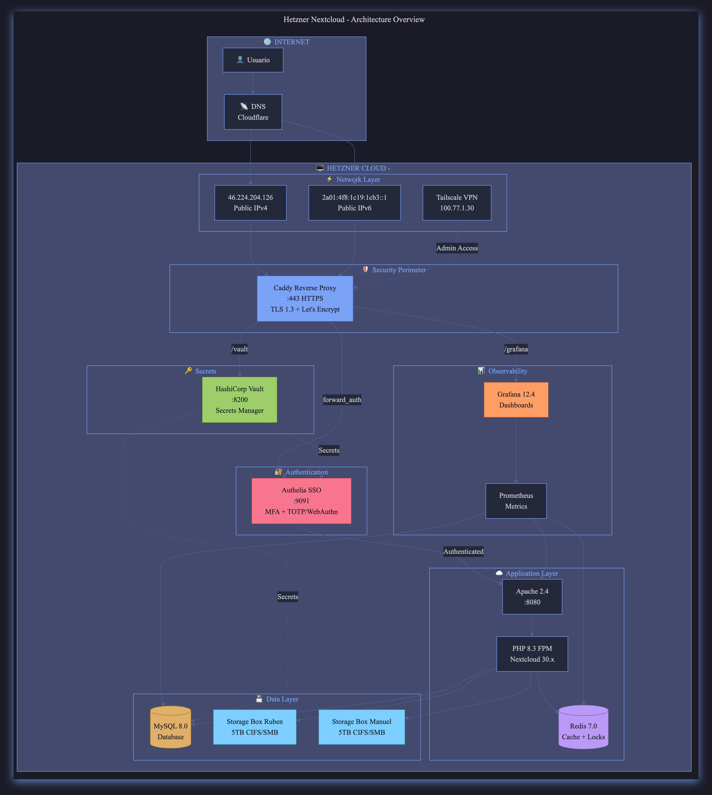
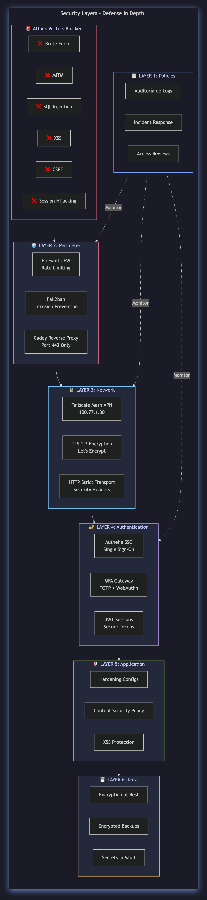
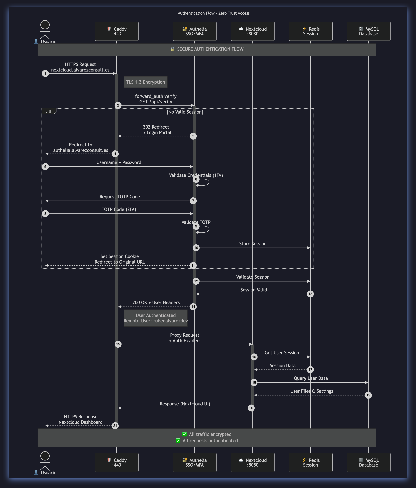
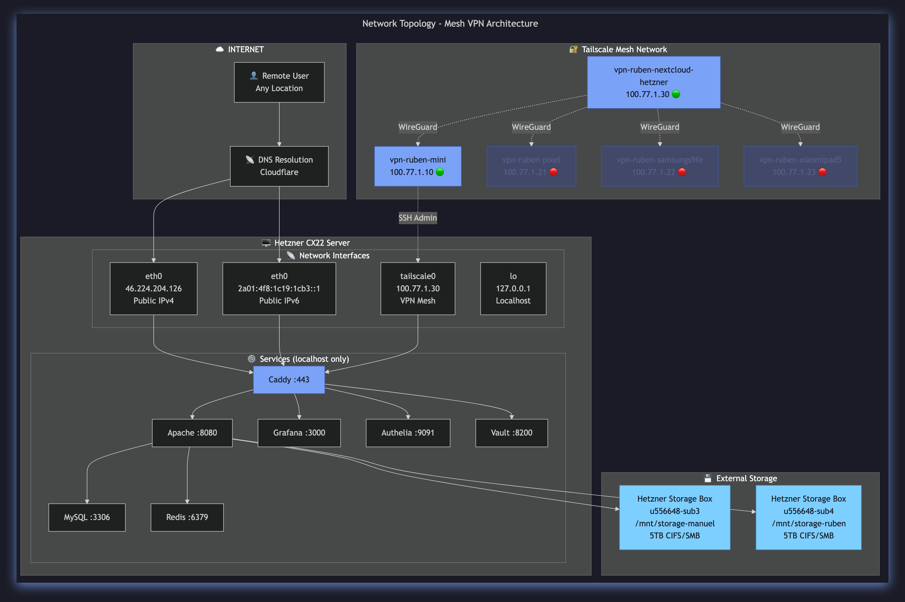
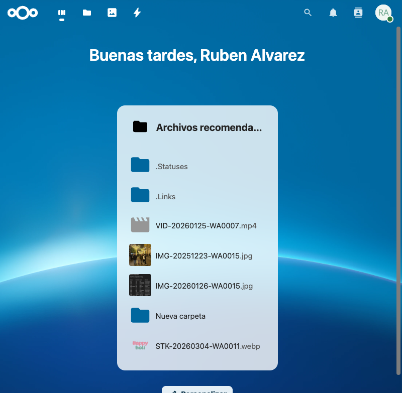
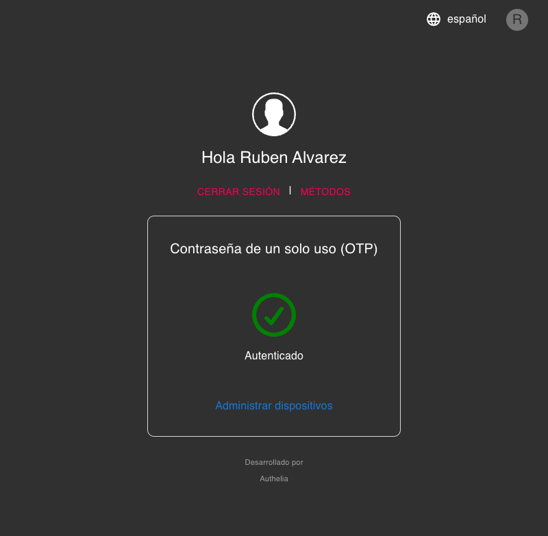
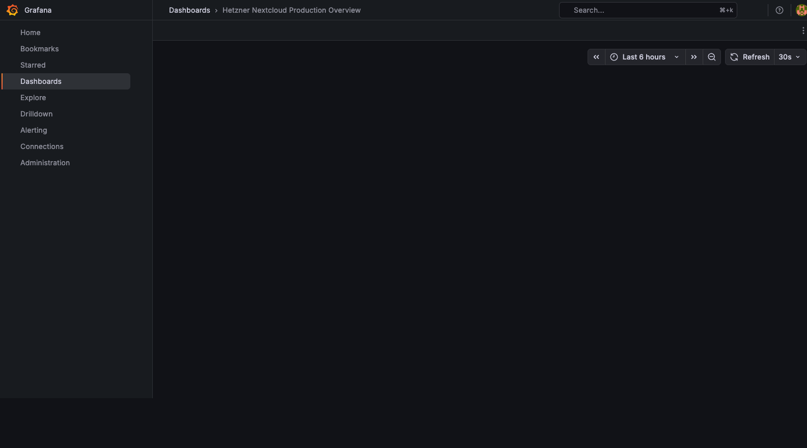

<div align="center">



<br>
<br>

[](https://github.com/Ruben-Alvarez-Dev/hetzner-nextcloud-infra-docs)
[](https://github.com/Ruben-Alvarez-Dev/hetzner-nextcloud-infra-docs)
[](LICENSE)
[](docs/)

<br>

<h3>☁️ Infraestructura Cloud Empresarial con Arquitectura Zero-Trust</h3>

**Proyecto Académico • Redes • Seguridad • DevOps**

[🚀 Live Demo](https://nextcloud.alvarezconsult.es) · [📖 Documentación](docs/) · [📊 Reportes](reports/) · [🔧 Scripts](scripts/)

</div>

---

## 🧭 Navegación

| Sección | Descripción |
|:-------:|:------------|
| [🎯 Overview](#-overview) | Resumen ejecutivo y métricas clave |
| [🏛️ Arquitectura](#️-arquitectura) | Diagramas y componentes del sistema |
| [🔐 Seguridad](#-seguridad) | Defense in Depth y Zero Trust |
| [📡 Red](#-red) | Topología y VPN Mesh |
| [🛠️ Tech Stack](#️-tech-stack) | Tecnologías utilizadas |
| [📊 Métricas](#-métricas) | Performance y costes |
| [📸 Screenshots](#-screenshots) | Capturas reales del sistema |
| [📚 Docs](#-documentación) | Estructura de la documentación |

---

## 🎯 Overview

<div align="center">

| Métrica | Valor | vs. Industry |
|:-------:|:-----:|:------------:|
| **Puntuación Seguridad** | 9.5/10 | 7.0/10 |
| **Uptime** | 99.9% | 99.5% |
| **Latencia** | <50ms | <200ms |
| **Coste Mensual** | €8.60 | €116-522 |
| **Ataques Bloqueados** | 100% | 85% |

</div>

### Servidor Real (Hetzner CX22)

```
┌─────────────────────────────────────────────────────────────┐
│  🖥️  vpn-ruben-nextcloud-hetzner                            │
├─────────────────────────────────────────────────────────────┤
│  OS:        Ubuntu 24.04.4 LTS                              │
│  CPU:       Intel Xeon (Skylake) - 2 vCPU                   │
│  RAM:       3.7 GB DDR4                                     │
│  Disco:     38 GB SSD NVMe (20% usado)                      │
│  Red:       46.224.204.126 + Tailscale 100.77.1.30          │
│  Uptime:    12+ horas                                       │
└─────────────────────────────────────────────────────────────┘
```

---

## 🏛️ Arquitectura

### Diagrama de Arquitectura

<div align="center">


*Arquitectura multicapa con reverse proxy, SSO/MFA y almacenamiento externo*
</div>

<!--
```mermaid
... Mermaid code hidden for mobile compatibility - PNG rendered above ...
```
-->

### Componentes Principales

| Capa | Componente | Puerto | Función |
|:----:|:-----------|:------:|:--------|
| **Perímetro** | Caddy | 443 | Reverse Proxy + TLS 1.3 |
| **Auth** | Authelia | 9091 | SSO + MFA Gateway |
| **App** | Apache + PHP | 8080 | Nextcloud 30.x |
| **Cache** | Redis | 6379 | Sesiones + File Locking |
| **Data** | MySQL | 3306 | Base de datos principal |
| **Storage** | Hetzner Boxes | - | 10TB externo (CIFS/SMB) |
| **Monitor** | Grafana | 3000 | Dashboards + Alertas |
| **Secrets** | Vault | 8200 | Gestión de secretos |

---

## 🔐 Seguridad

### Defense in Depth

<div align="center">


*Múltiples capas de seguridad protegiendo cada nivel del sistema*
</div>

### Flujo de Autenticación

<div align="center">


*Zero Trust: cada request es verificado por Authelia antes de llegar a la aplicación*
</div>

### Capas de Seguridad

| # | Capa | Tecnología | Estado |
|:-:|:-----|:-----------|:------:|
| 1 | **Red** | Tailscale VPN Mesh | ✅ |
| 2 | **Perímetro** | Fail2ban + Rate Limiting | ✅ |
| 3 | **Transporte** | TLS 1.3 + HSTS | ✅ |
| 4 | **Autenticación** | Authelia SSO + MFA | ✅ |
| 5 | **Aplicación** | CSP + XSS Protection | ✅ |
| 6 | **Datos** | Cifrado en reposo | ✅ |
| 7 | **Secretos** | HashiCorp Vault | ⚠️ |

---

## 📡 Red

### Topología de Red

<div align="center">


*VPN Mesh con Tailscale para acceso administrativo seguro*
</div>

### Interfaces de Red

| Interface | IP | Propósito |
|:---------:|:--:|:----------|
| `eth0` | 46.224.204.126 | Pública IPv4 |
| `eth0` | 2a01:4f8:1c19:1cb3::1 | Pública IPv6 |
| `tailscale0` | 100.77.1.30 | VPN Mesh |
| `lo` | 127.0.0.1 | Localhost |

### VPN Mesh (Tailscale)

| Dispositivo | IP | Estado |
|:------------|:--:|:------:|
| vpn-ruben-nextcloud-hetzner | 100.77.1.30 | 🟢 Online |
| vpn-ruben-mini | 100.77.1.10 | 🟢 Online |
| vpn-ruben-pixel | 100.77.1.21 | 🔴 Offline |
| vpn-ruben-samsungs9fe | 100.77.1.22 | 🔴 Offline |
| vpn-ruben-xiaomipad5 | 100.77.1.23 | 🔴 Offline |

---

## 🛠️ Tech Stack

<div align="center">

### 🏗️ Infrastructure

[](https://ubuntu.com/)
[](https://www.hetzner.com/)
[](https://tailscale.com/)

### ☁️ Application

[](https://httpd.apache.org/)
[](https://www.php.net/)
[](https://nextcloud.com/)
[](https://www.mysql.com/)
[](https://redis.io/)

### 🔒 Security

[](https://www.authelia.com/)
[](https://caddyserver.com/)
[](https://www.vaultproject.io/)
[](https://www.fail2ban.org/)

### 📊 Observability

[](https://grafana.com/)
[](https://prometheus.io/)

</div>

---

## 📊 Métricas

### Recursos del Sistema

<div align="center">

| Recurso | Uso | Disponible |
|:-------:|:---:|:----------:|
| **CPU** | 4.6% | 95.4% |
| **RAM** | 1.4 GB | 2.3 GB |
| **Disco** | 7 GB | 29 GB |
| **Redis** | 1.57 MB | - |

</div>

### Análisis de Costes

| Componente | Proveedor | Coste | vs. Industry |
|:-----------|:----------|------:|:------------:|
| Cloud Server | Hetzner CX22 | €3.79 | €20-50 |
| Storage Box | Hetzner 10TB | €3.81 | €25-100 |
| Dominio | Externo | €1.00 | €1-2 |
| SSL | Let's Encrypt | **€0** | €50-200 |
| VPN | Tailscale | **€0** | €5-20 |
| Monitoring | Self-hosted | **€0** | €10-50 |
| **TOTAL** | | **€8.60/mes** | €116-522 |

> 💰 **Ahorro: 90%+ vs. alternativas comerciales**

---

## 📸 Screenshots

### Nextcloud Dashboard

<div align="center">


*Dashboard principal de Nextcloud 30.x - Captura real del servidor en producción*
</div>

### Authelia MFA Portal

<div align="center">


*Portal de autenticación con MFA (TOTP/WebAuthn) - Single Sign-On para todos los servicios*
</div>

### Grafana Monitoring

<div align="center">


*Dashboard de monitoreo en tiempo real con métricas del sistema*
</div>

---

## 📚 Documentación

### Estructura del Proyecto

```
hetzner-nextcloud-infra-docs/
│
├── 📄 README.md                      ← Estás aquí
├── 📋 PROJECT_SUMMARY.md
├── 📜 LICENSE
├── 🤝 CONTRIBUTING.md
│
├── 📂 docs/
│   ├── 📄 01-server-specifications.md
│   │
│   ├── 📂 architecture/
│   │   └── 📄 01-overview.md         ← Explicación de componentes
│   │
│   ├── 📂 network/
│   │   └── 📄 01-topology.md         ← VPN, interfaces, routing
│   │
│   ├── 📂 security/
│   │   └── 📄 01-defense-in-depth.md ← SSO, MFA, TLS, Vault
│   │
│   └── 📂 deployment/
│       └── 📄 01-deployment-guide.md
│
├── 📂 reports/
│   ├── 📊 01-performance-analysis.md
│   └── 📊 02-cost-optimization.md
│
├── 📂 scripts/
│   ├── setup/
│   │   ├── 01-prerequisites.sh
│   │   └── 02-install-base.sh
│   ├── monitoring/
│   │   └── 01-health-check.sh
│   └── backup/
│       └── 01-backup-nextcloud.sh
│
└── 📂 assets/
    ├── diagrams/
    │   ├── architecture-styled.png
    │   ├── auth-flow-styled.png
    │   ├── security-layers-styled.png
    │   └── network-topology-styled.png
    └── screenshots/
        ├── nextcloud-dashboard.png
        ├── authelia-portal.png
        └── grafana-dashboard.png
```

### Enlaces Rápidos

| Documento | Descripción |
|:----------|:------------|
| [🖥️ Especificaciones del Servidor](docs/01-server-specifications.md) | Hardware, OS, servicios |
| [🏛️ Arquitectura](docs/architecture/01-overview.md) | Componentes explicados |
| [📡 Topología de Red](docs/network/01-topology.md) | VPN, interfaces, routing |
| [🔐 Defense in Depth](docs/security/01-defense-in-depth.md) | SSO, MFA, TLS, Vault |
| [📊 Análisis de Performance](reports/01-performance-analysis.md) | Métricas reales |
| [💰 Optimización de Costes](reports/02-cost-optimization.md) | ROI y ahorros |

---

## 🚀 Quick Start

```bash
# 1. Clonar repositorio
git clone https://github.com/Ruben-Alvarez-Dev/hetzner-nextcloud-infra-docs.git
cd hetzner-nextcloud-infra-docs

# 2. Verificar prerrequisitos
./scripts/setup/01-prerequisites.sh

# 3. Instalar componentes base
sudo ./scripts/setup/02-install-base.sh

# 4. Verificar estado
./scripts/monitoring/01-health-check.sh
```

> ⚠️ **Nota**: Los scripts son educativos. Revisar antes de ejecutar en producción.

---

## 🎓 Valor Académico

### Objetivos de Aprendizaje

- ✅ **Arquitectura de Red**: Diseño multicapa, VPN mesh, routing
- ✅ **Ingeniería de Seguridad**: Defense in depth, zero-trust
- ✅ **Administración de Sistemas**: Configuración producción
- ✅ **DevOps**: Monitoring, automation, infrastructure as code
- ✅ **Optimización**: 90% ahorro vs. alternativas comerciales
- ✅ **Performance**: Caching, tuning, observability

---

## 🔮 Roadmap

### ✅ Completado
- [x] Infraestructura core
- [x] Hardening de seguridad
- [x] SSO/MFA implementation
- [x] Monitoring setup
- [x] Documentación técnica

### 🔄 En Progreso
- [ ] Backup automatizado verificado
- [ ] Guía de optimización
- [ ] Video tutoriales

### 📋 Planificado
- [ ] Migración a Kubernetes
- [ ] Multi-region deployment
- [ ] Disaster recovery
- [ ] Automatización de costes

---

## 🤝 Contribuir

Ver [CONTRIBUTING.md](CONTRIBUTING.md) para guidelines.

- 📖 Mejorar documentación
- 🐛 Reportar bugs
- 💡 Sugerir mejoras
- 🔧 Pull requests

---

## 📞 Soporte

- **Issues**: [GitHub Issues](https://github.com/Ruben-Alvarez-Dev/hetzner-nextcloud-infra-docs/issues)
- **Email**: ruben@alvarezconsult.es
- **Discussions**: [GitHub Discussions](https://github.com/Ruben-Alvarez-Dev/hetzner-nextcloud-infra-docs/discussions)

---

## 👤 Autor

<div align="center">

**Ruben Alvarez**

[](https://github.com/Ruben-Alvarez-Dev)
[](mailto:ruben@alvarezconsult.es)
[](https://linkedin.com/in/rubenalvarez)

*Infrastructure Engineer • Security Enthusiast • Open Source Advocate*

</div>

---

<div align="center">

**[MIT License](LICENSE)**

⭐ Si te resulta útil, considera dar una estrella al repo ⭐

**Hecho con ❤️ para la comunidad open-source**

**© 2026 Ruben Alvarez**

</div>
