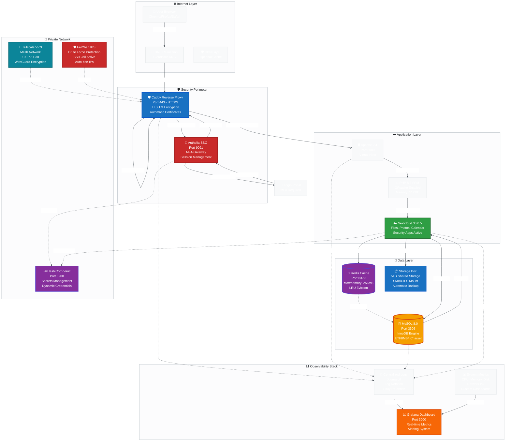

# 🏗️ Architecture Overview

## 📊 Component Details

### Network Perimeter
| Component | Technology | Purpose | Port |
|-----------|-----------|---------|------|
| **Reverse Proxy** | Caddy 2.11 | HTTPS termination, routing | 443 |
| **SSO Gateway** | Authelia 4.38 | Authentication, MFA | 9091 |
| **Firewall** | iptables + Fail2ban | Intrusion prevention | All |

### Application Layer
| Component | Technology | Purpose | Port |
|-----------|-----------|---------|------|
| **Web Server** | Apache 2.4 | HTTP server | 8080 |
| **PHP Runtime** | PHP 8.3 FPM | Application processing | 9000 |
| **Application** | Nextcloud 30.0.5 | File sharing, collaboration | 8080 |

### Data Layer
| Component | Technology | Purpose | Port |
|-----------|-----------|---------|------|
| **Database** | MySQL 8.0 | Relational data storage | 3306 |
| **Cache** | Redis 7.x | Session & query cache | 6379 |
| **Backup Storage** | Hetzner Storage Box | External backup | SMB |

### Security Layer
| Component | Technology | Purpose | Port |
|-----------|-----------|---------|------|
| **VPN** | Tailscale | Encrypted mesh network | 41641 |
| **Secrets** | HashiCorp Vault | Credential management | 8200 |
| **IPS** | Fail2ban | Brute force protection | - |

### Monitoring Layer
| Component | Technology | Purpose | Port |
|-----------|-----------|---------|------|
| **Dashboard** | Grafana 11 | Metrics visualization | 3000 |
| **Logging** | Journalctl | Centralized logs | - |
| **Metrics** | Custom | System monitoring | - |

## 🔗 Related Diagrams

- [Network Flow Diagram](./02-network-flow.md) - Request/response flow
- [Security Layers](./03-security-layers.md) - Defense in depth
- [Performance Metrics](./04-performance-metrics.md) - Resource utilization

---

**Last Updated**: 2026-03-04
